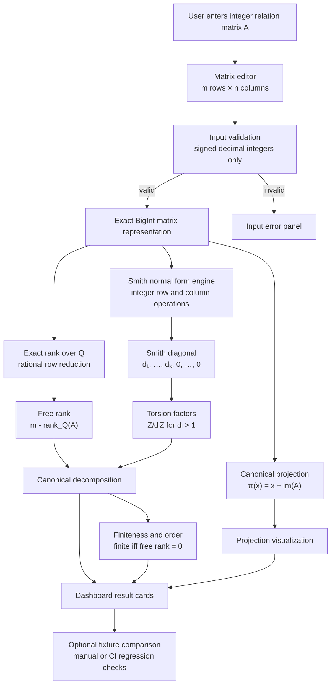

# AQARION Relation Matrix Dashboard

## Purpose

The AQARION Relation Matrix Dashboard is an interactive browser tool for
computing the structure of finitely generated abelian groups presented by
integer relation matrices.

The dashboard accepts an integer matrix:

[
Ainoperatorname{Mat}_{m\times n}(mathbb Z),
]

interprets it as a homomorphism:

[
A:mathbb Z^nlongrightarrowmathbb Z^m,
]

and displays the quotient group:

[
operatorname{coker}(A)
=
mathbb Z^m/operatorname{im}(A).
]

It computes Smith normal form data and renders the invariant-factor
decomposition:

\\[
operatorname{coker}(A)
cong
mathbb Z^r
oplus
mathbb Z/d_1mathbb Z
opluscdotsoplus
mathbb Z/d_tmathbb Z,
]

where:

[
d_i>1,
qquad
d_imid d_{i+1}.
]

## Scope

```text
Supported:
- Integer relation matrices.
- Finite abelian groups.
- Finitely generated abelian groups.
- Exact integer arithmetic.
- Smith normal form invariant-factor decomposition.
- Free-rank calculation.
- Torsion-factor calculation.
- Finite quotient order when the free rank is zero.
- Canonical projection visualization:
  pi(x) = x + im(A).

Not supported:
- Arbitrary infinitely generated abelian groups.
- Nonabelian group quotients.
- Infinite relation sets.
- Proof-assistant certification.
- Large-matrix performance guarantees.
- Automatic derivation of a relation matrix from informal prose.
```

## Overview

The AQARION Relation Matrix Dashboard is an interactive, browser-based tool for
working with finite integer presentations of finitely generated abelian groups.

A user enters an integer matrix:

\[
A\in\operatorname{Mat}_{m\times n}(\mathbb Z),
\]

which the dashboard interprets as a homomorphism:

\[
A:\mathbb Z^n\longrightarrow\mathbb Z^m.
\]

The displayed group is the cokernel:

\[
\boxed{
\operatorname{coker}(A)
=
\mathbb Z^m/\operatorname{im}(A).
}
\]

The dashboard computes Smith normal form data for \(A\) and renders the
canonical invariant-factor decomposition:

\[
\operatorname{coker}(A)
\cong
\mathbb Z^r
\oplus
\mathbb Z/d_1\mathbb Z
\oplus\cdots\oplus
\mathbb Z/d_t\mathbb Z,
\]

where:

\[
d_i>1,
\qquad
d_i\mid d_{i+1}.
\]

The free rank \(r\), torsion invariant factors \(d_i\), finite-versus-infinite
status, quotient order when finite, and canonical projection map are displayed
in the dashboard.

## Scope

```text
Supported:
- Finite integer matrices.
- Finitely generated abelian groups.
- Quotients represented as cokernels.
- Exact integer arithmetic through JavaScript BigInt.
- Smith normal form invariant-factor decomposition.
- Free-rank and torsion-factor extraction.
- Canonical projection map visualization.
- Finite quotient order when the quotient has free rank zero.

Not supported:
- Arbitrary infinitely generated abelian groups.
- Nonabelian group presentations.
- Quotients by non-normal subgroups.
- Infinite relation sets.
- Floating-point matrix input.
- Proof-assistant certification.
- Large-matrix performance guarantees.
```

## Mathematical convention

### Matrix orientation

The dashboard uses the following fixed convention:

\[
A:\mathbb Z^n\longrightarrow\mathbb Z^m.
\]

The matrix has:

```text
m rows:
ambient free generators of Z^m

n columns:
integer relation generators
```

The \(j\)-th column of \(A\) is the relation vector:

\[
A_{\ast j}\in\mathbb Z^m.
\]

The relation subgroup is:

\[
\operatorname{im}(A)
=
\left\langle
A_{\ast1},
A_{\ast2},
\ldots,
A_{\ast n}
\right\rangle.
\]

The group represented by the matrix is:

\[
\boxed{
\operatorname{coker}(A)
=
\mathbb Z^m/\operatorname{im}(A).
}
\]

This is a **cokernel** dashboard, not a kernel dashboard.

### Canonical projection

The dashboard visualizes the canonical quotient homomorphism:

\[
\pi:\mathbb Z^m\longrightarrow\operatorname{coker}(A),
\qquad
\pi(x)=x+\operatorname{im}(A).
\]

It records the following properties:

\[
\pi(x+y)=\pi(x)+\pi(y),
\]

\[
\ker(\pi)=\operatorname{im}(A),
\]

and:

\[
\pi(0)=\operatorname{im}(A),
\]

where \(\operatorname{im}(A)\) is the identity coset in the quotient.

## Smith normal form

### Definition

For every integer matrix:

\[
A\in\operatorname{Mat}_{m\times n}(\mathbb Z),
\]

there exist unimodular integer matrices:

\[
U\in GL_m(\mathbb Z),
\qquad
V\in GL_n(\mathbb Z),
\]

such that:

\[
UAV
=
D,
\]

where:

\[
D
=
\operatorname{diag}(d_1,\ldots,d_k,0,\ldots,0),
\]

with:

\[
d_i>0,
\qquad
d_i\mid d_{i+1}.
\]

The diagonal matrix \(D\) is the Smith normal form of \(A\).

The dashboard uses the Smith diagonal entries to classify the quotient group.

### Cokernel decomposition

If \(A\) has \(m\) rows and Smith diagonal:

\[
D=
\operatorname{diag}(d_1,\ldots,d_k,0,\ldots,0),
\]

then:

\[
\operatorname{coker}(A)
\cong
\mathbb Z^{m-k}
\oplus
\mathbb Z/d_1\mathbb Z
\oplus\cdots\oplus
\mathbb Z/d_k\mathbb Z.
\]

The dashboard omits entries where:

\[
d_i=1,
\]

because:

\[
\mathbb Z/1\mathbb Z
\cong
0.
\]

The displayed canonical structure is therefore:

\[
\boxed{
\operatorname{coker}(A)
\cong
\mathbb Z^{m-k}
\oplus
\bigoplus_{d_i>1}\mathbb Z/d_i\mathbb Z.
}
\]

### Interpretation table

| Smith output | Contribution to \(\operatorname{coker}(A)\) |
|---|---|
| A missing pivot / trailing zero | One free \(\mathbb Z\) factor |
| \(d_i=1\) | Trivial factor; omitted from display |
| \(d_i>1\) | Torsion factor \(\mathbb Z/d_i\mathbb Z\) |
| No free factors | Quotient is finite |
| One or more free factors | Quotient has infinite order |

### Free rank

The quotient free rank is:

\[
\operatorname{rank}_{\mathbb Z}\operatorname{coker}(A)
=
m-\operatorname{rank}_{\mathbb Q}(A).
\]

Equivalently, if the Smith normal form has \(k\) nonzero entries:

\[
\boxed{
\text{free rank}=m-k.
}
\]

### Finite quotient order

The quotient is finite exactly when:

\[
\operatorname{rank}_{\mathbb Q}(A)=m.
\]

When the quotient is finite:

\[
\left|\operatorname{coker}(A)\right|
=
\prod_{d_i>1}d_i.
\]

When the free rank is positive, the quotient has infinite order.

## Module structure

```text
relation-matrix-dashboard/
├── README.md
├── MATHEMATICAL_SPECIFICATION.md
├── INPUT_OUTPUT_SCHEMA.md
├── TESTING.md
├── .gitignore
├── index.html
├── styles.css
├── app.js
├── examples/
│   ├── README.md
│   ├── cyclic-z12-mod-4.json
│   ├── diagonal-z4-z12.json
│   ├── free-plus-torsion.json
│   ├── zero-matrix.json
│   ├── noncyclic-z2-z2.json
│   └── mixed-relation-example.json
├── fixtures/
│   ├── README.md
│   └── snf-fixtures.json
└── artifacts/
    └── .gitkeep
```

### Module responsibilities

| Path | Responsibility |
|---|---|
| `index.html` | Dashboard markup, user controls, labels, panels, tooltips, result regions |
| `styles.css` | Responsive layout, matrix editor presentation, result-card styling, visualization styling |
| `app.js` | Exact BigInt arithmetic, matrix editor, Smith-normal-form computation, rank computation, rendering, presets, tooltip behavior |
| `MATHEMATICAL_SPECIFICATION.md` | Formal mathematical convention and scope |
| `INPUT_OUTPUT_SCHEMA.md` | Matrix input format and quotient result schema |
| `TESTING.md` | Static checks, fixture checks, browser checks, negative-input tests |
| `examples/` | Reusable documented relation-matrix inputs |
| `fixtures/` | Expected SNF outputs for regression testing |
| `artifacts/` | Local or CI-generated receipts, reports, logs, and hashes |

## Architecture



## Implementation architecture

### `app.js` functional layers

The JavaScript implementation is organized conceptually into these layers:

```text
1. Input layer
   - Matrix dimensions.
   - Matrix editor cell values.
   - Preset loading.
   - Integer parsing and validation.

2. Exact arithmetic layer
   - BigInt integer helpers.
   - gcd calculations.
   - Rational arithmetic used only for rank computation.

3. Matrix operation layer
   - Row and column swaps.
   - Row and column additions.
   - Integer row scaling by -1.
   - Matrix cloning.
   - Matrix display formatting.

4. Smith normal form layer
   - Pivot search.
   - Euclidean pivot reduction.
   - Row and column elimination.
   - Divisibility-chain enforcement.
   - Extraction of nonzero diagonal factors.

5. Quotient classification layer
   - Rational rank.
   - Free rank.
   - Torsion invariant factors.
   - Finite quotient detection.
   - Quotient order.
   - Cyclic versus non-cyclic status.

6. Dashboard rendering layer
   - Canonical decomposition.
   - Projection map.
   - Identity and kernel display.
   - Smith diagonal display.
   - Projection visualization.
   - Error reporting.

7. Verification layer
   - Static JavaScript syntax checks.
   - JSON example validation.
   - Fixture-based expected output checks.
   - CI receipt generation.
```

## Dependencies

### Runtime dependencies

The dashboard has no package-manager dependency and no external library requirement.

```text
HTML:
Standard browser HTML support.

CSS:
Standard browser CSS support.

JavaScript:
Modern browser support for:
- BigInt
- const / let
- template literals
- Array methods
- DOM APIs
```

### Required browser support

The dashboard requires a browser with `BigInt` support.

Typical supported browsers include current versions of:

```text
- Chromium / Chrome
- Firefox
- Edge
- Safari
```

### Development dependencies

The following tools are optional but recommended:

| Tool | Purpose |
|---|---|
| Python 3 | Local static HTTP server and JSON validation |
| Node.js | JavaScript syntax validation through `node --check` |
| Git | Version control and receipt hashes |
| `sha256sum` | File-integrity receipt generation |

No npm installation is required.

## Run locally

### Standard local run

From the repository root:

```bash
cd relation-matrix-dashboard
python -m http.server 8080
```

Open:

```text
http://localhost:8080
```

### Termux run

```bash
pkg install python nodejs git
cd ~/Aqarion-Quantarion-AI/relation-matrix-dashboard
python -m http.server 8080
```

Then browse to:

```text
http://localhost:8080
```

### JavaScript syntax check

From the repository root:

```bash
node --check relation-matrix-dashboard/app.js
```

### Validate included JSON examples

```bash
for file in relation-matrix-dashboard/examples/*.json; do
  python -m json.tool "$file" > /dev/null
done

python -m json.tool \
  relation-matrix-dashboard/fixtures/snf-fixtures.json \
  > /dev/null
```

## Usage guide

### Step 1: Choose dimensions

Set:

```text
m = number of rows
n = number of columns
```

The dashboard interprets the matrix as:

\[
A:\mathbb Z^n\to\mathbb Z^m.
\]

The quotient begins from:

\[
\mathbb Z^m.
\]

### Step 2: Enter relation columns

Each column is a relation vector in \(\mathbb Z^m\).

For example, the matrix:

\[
A=
\begin{bmatrix}
12 & 4
\end{bmatrix}
\]

has:

```text
m = 1
n = 2
```

and relation vectors:

\[
12,\qquad4.
\]

Thus:

\[
\operatorname{im}(A)=\langle12,4\rangle=4\mathbb Z.
\]

### Step 3: Compute Smith normal form

Click:

```text
Compute Smith normal form
```

The dashboard calculates:

```text
- Smith diagonal entries.
- Matrix rank over Q.
- Free rank.
- Torsion invariant factors.
- Finite or infinite quotient status.
- Quotient order if finite.
- Cyclic or non-cyclic status.
- Canonical projection information.
```

### Step 4: Read the quotient decomposition

The main result panel displays:

\[
\operatorname{coker}(A)
\cong
\mathbb Z^r
\oplus
\bigoplus_i\mathbb Z/d_i\mathbb Z.
\]

The dashboard omits trivial factors:

\[
\mathbb Z/1\mathbb Z.
\]

## Common examples

### Example 1: Cyclic quotient

To calculate:

\[
(\mathbb Z/12\mathbb Z)/\langle4\rangle,
\]

enter:

\[
A=
\begin{bmatrix}
12 & 4
\end{bmatrix}.
\]

#### Matrix editor values

```text
Rows:    1
Columns: 2

A = 12[1]
A = 4[2][1]
```

#### Expected computation

\[
\operatorname{SNF}(A)
=
\begin{bmatrix}
4 & 0
\end{bmatrix}.
\]

Therefore:

\[
\operatorname{coker}(A)
\cong
\mathbb Z/4\mathbb Z.
\]

### Example 2: Finite non-cyclic quotient

Enter:

\[
A=
\begin{bmatrix}
2 & 0\\
0 & 2
\end{bmatrix}.
\]

The quotient is:

\[
\operatorname{coker}(A)
\cong
\mathbb Z/2\mathbb Z
\oplus
\mathbb Z/2\mathbb Z.
\]

It has order:

\[
4,
\]

but it is not cyclic.

This distinguishes it from:

\[
\mathbb Z/4\mathbb Z,
\]

which has the same order but a different invariant-factor decomposition.

### Example 3: Free plus torsion

Enter:

\[
A=
\begin{bmatrix}
0\\
6
\end{bmatrix}.
\]

The relation subgroup is generated by:

\[
(0,6).
\]

Thus:

\[
\operatorname{coker}(A)
\cong
\mathbb Z\oplus\mathbb Z/6\mathbb Z.
\]

The quotient has:

```text
Free rank: 1
Torsion factors: Z/6Z
Order: infinite
```

### Example 4: Free rank two

Use:

```text
Rows:    2
Columns: 0
```

This represents:

\[
A:\mathbb Z^0\to\mathbb Z^2.
\]

Then:

\[
\operatorname{coker}(A)
=
\mathbb Z^2.
\]

### Example 5: Mixed presentation matrix

Enter:

\[
A=
\begin{bmatrix}
2 & 4\\
0 & 6
\end{bmatrix}.
\]

The Smith diagonal is:

\[
\operatorname{diag}(2,6).
\]

Therefore:

\[
\operatorname{coker}(A)
\cong
\mathbb Z/2\mathbb Z
\oplus
\mathbb Z/6\mathbb Z.
\]

The quotient is finite of order:

\[
2\cdot6=12.
\]

## Common matrix operations

The dashboard implements its Smith-normal-form procedure through exact integer
row and column operations. The following examples show the mathematical
operations represented by the JavaScript helper logic.

### Matrix creation

```javascript
function zeroMatrix(rows, columns) {
  return Array.from(
    { length: rows },
    () => Array.from({ length: columns }, () => 0n),
  );
}

const A = zeroMatrix(2, 3);
```

This creates:

\[
A=
\begin{bmatrix}
0 & 0 & 0\\
0 & 0 & 0
\end{bmatrix}.
\]

### Exact integer GCD

```javascript
function absBigInt(value) {
  return value < 0n ? -value : value;
}

function gcdBigInt(a, b) {
  a = absBigInt(a);
  b = absBigInt(b);

  while (b !== 0n) {
    [a, b] = [b, a % b];
  }

  return a;
}

const divisor = gcdBigInt(12n, 4n);
// divisor === 4n
```

For a \(1\times n\) presentation matrix, the Smith factor is the greatest
common divisor of the row entries.

### Swap two rows

```javascript
function swapRows(matrix, firstRow, secondRow) {
  [matrix[firstRow], matrix[secondRow]] =
    [matrix[secondRow], matrix[firstRow]];
}

const A = [
  [0n, 6n],
  [2n, 4n],
];

swapRows(A, 0, 1);
```

This applies a unimodular row operation, preserving the cokernel isomorphism
type after corresponding basis change.

### Swap two columns

```javascript
function swapColumns(matrix, firstColumn, secondColumn) {
  for (const row of matrix) {
    [row[firstColumn], row[secondColumn]] =
      [row[secondColumn], row[firstColumn]];
  }
}

const A = [
  [12n, 4n],
];

swapColumns(A, 0, 1);
```

This changes the chosen generating list for the relation subgroup but preserves
the subgroup itself up to an invertible change of relation basis.

### Add an integer multiple of one row to another

```javascript
function addRowMultiple(matrix, targetRow, sourceRow, multiple) {
  for (let column = 0; column < matrix[targetRow].length; column += 1) {
    matrix[targetRow][column] += multiple * matrix[sourceRow][column];
  }
}

const A = [
  [2n, 4n],
  [0n, 6n],
];

addRowMultiple(A, 1, 0, -3n);
```

This is the row operation:

\[
R_2\leftarrow R_2-3R_1.
\]

### Add an integer multiple of one column to another

```javascript
function addColumnMultiple(matrix, targetColumn, sourceColumn, multiple) {
  for (let row = 0; row < matrix.length; row += 1) {
    matrix[row][targetColumn] += multiple * matrix[row][sourceColumn];
  }
}

const A = [
  [12n, 4n],
];

addColumnMultiple(A, 0, 1, -3n);
```

This gives:

\[
\begin{bmatrix}
12 & 4
\end{bmatrix}
\longrightarrow
\begin{bmatrix}
0 & 4
\end{bmatrix}.
\]

A column swap then gives the Smith presentation:

\[
\begin{bmatrix}
4 & 0
\end{bmatrix}.
\]

### Rational rank calculation

The dashboard separately computes rank over \(\mathbb Q\) through exact
fraction-style elimination rather than floating-point numerical rank.

Conceptually:

```javascript
const rank = matrixRankOverQ(A);
const freeRank = rowCount - rank;
```

For:

\[
A=
\begin{bmatrix}
0\\
6
\end{bmatrix},
\]

the rank is:

\[
1,
\]

and the free rank is:

\[
2-1=1.
\]

### Construct quotient metadata

```javascript
const result = {
  rows: 2,
  columns: 2,
  diagonal: [2n, 6n],
  rank: 2,
  freeRank: 0,
  torsionFactors: [2n, 6n],
  finite: true,
  order: 12n,
};
```

The corresponding group is:

\[
\mathbb Z/2\mathbb Z
\oplus
\mathbb Z/6\mathbb Z.
\]

## Converting G/H into a presentation matrix

The dashboard takes a relation matrix, not a symbolic group-and-subgroup pair.
To calculate a quotient \(G/H\), construct a presentation matrix first.

Suppose:

\[
G
\cong
\mathbb Z^r
\oplus
\mathbb Z/n_1\mathbb Z
\oplus\cdots\oplus
\mathbb Z/n_t\mathbb Z.
\]

Let:

\[
q=r+t.
\]

Start with \(\mathbb Z^q\).

### Add torsion relations

For every finite factor:

\[
\mathbb Z/n_i\mathbb Z,
\]

add the relation column:

\[
n_i e_{r+i}.
\]

### Add subgroup-generator relations

If \(H\) is generated by vectors:

\[
h^{(1)},\ldots,h^{(s)}
\in\mathbb Z^q,
\]

append those vectors as additional relation columns.

Then:

\[
G/H
\cong
\mathbb Z^q/L,
\]

where \(L\) is the subgroup generated by all torsion columns and all subgroup
generator columns.

### Example

Let:

\[
G=
\mathbb Z
\oplus
\mathbb Z/4\mathbb Z
\oplus
\mathbb Z/12\mathbb Z,
\]

and:

\[
H=
\left\langle
(2,1,3),
(0,2,6)
\right\rangle.
\]

The ambient free group is:

\[
\mathbb Z^3.
\]

The torsion relations are:

\[
\begin{bmatrix}
0\\
4\\
0
\end{bmatrix},
\qquad
\begin{bmatrix}
0\\
0\\
12
\end{bmatrix}.
\]

The subgroup relations are:

\[
\begin{bmatrix}
2\\
1\\
3
\end{bmatrix},
\qquad
\begin{bmatrix}
0\\
2\\
6
\end{bmatrix}.
\]

The presentation matrix is:

\[
A=
\begin{bmatrix}
0 & 0 & 2 & 0\\
4 & 0 & 1 & 2\\
0 & 12 & 3 & 6
\end{bmatrix}.
\]

The dashboard computes:

\[
\operatorname{coker}(A)
\cong
G/H.
\]

## Validation and testing

### Required static checks

From the repository root:

```bash
test -f relation-matrix-dashboard/index.html
test -f relation-matrix-dashboard/styles.css
test -f relation-matrix-dashboard/app.js
test -f relation-matrix-dashboard/README.md
test -f relation-matrix-dashboard/MATHEMATICAL_SPECIFICATION.md
test -f relation-matrix-dashboard/INPUT_OUTPUT_SCHEMA.md
test -f relation-matrix-dashboard/TESTING.md

node --check relation-matrix-dashboard/app.js
```

### Validate example and fixture JSON

```bash
for file in relation-matrix-dashboard/examples/*.json; do
  python -m json.tool "$file" > /dev/null
done

python -m json.tool \
  relation-matrix-dashboard/fixtures/snf-fixtures.json \
  > /dev/null
```

### Required regression examples

| Input matrix | Expected quotient |
|---|---|
| \([12\;\;4]\) | \(\mathbb Z/4\mathbb Z\) |
| \(\operatorname{diag}(4,12)\) | \(\mathbb Z/4\mathbb Z\oplus\mathbb Z/12\mathbb Z\) |
| \(\begin{bmatrix}0\\6\end{bmatrix}\) | \(\mathbb Z\oplus\mathbb Z/6\mathbb Z\) |
| \(2\times0\) matrix | \(\mathbb Z^2\) |
| \(\operatorname{diag}(2,2)\) | \(\mathbb Z/2\mathbb Z\oplus\mathbb Z/2\mathbb Z\) |
| \([1]\) | Trivial group \(0\) |
| \(\begin{bmatrix}2&4\\0&6\end{bmatrix}\) | \(\mathbb Z/2\mathbb Z\oplus\mathbb Z/6\mathbb Z\) |

### Important anti-regression rule

Do not validate only group order.

For example:

\[
\mathbb Z/4\mathbb Z
\]

and:

\[
\mathbb Z/2\mathbb Z\oplus\mathbb Z/2\mathbb Z
\]

both have order \(4\), but they are not isomorphic. The dashboard must display
and test invariant factors.

## Generated artifacts

Generated artifacts belong in:

```text
relation-matrix-dashboard/artifacts/
```

Typical generated files include:

```text
dashboard-test-report.json
dashboard-test.log
dashboard-receipt.sha256
local-session-notes.txt
```

The local folder `.gitignore` excludes generated artifacts while preserving:

```text
relation-matrix-dashboard/artifacts/.gitkeep
```

## Limitations

### Mathematical limitations

The dashboard classifies groups only relative to the entered presentation
matrix.

It does not determine whether a user’s matrix faithfully encodes some external
problem statement. The mathematical meaning of the relation columns remains the
user’s responsibility.

The dashboard also does not support:

```text
- Nonabelian presentations.
- Non-normal quotient constructions.
- Infinite-dimensional integer modules.
- Arbitrary divisible abelian groups.
- Infinite relation matrices.
```

### Computational limitations

The implementation is intended for educational, exploratory, and moderate-size
integer matrices.

Large entries or large matrices can make exact Smith-normal-form reduction
slow in a browser because arbitrary-precision integer arithmetic and repeated
Euclidean row/column reductions are required.

The dashboard UI should enforce documented dimension limits rather than imply
unbounded computational performance.

## Governance and claim boundary

```text
Exact arithmetic:
Yes, for entered integer values using JavaScript BigInt.

Finite fixture validation:
Required.

Formal proof:
OPEN.

Independent external reproduction:
NOT CLAIMED.

C4:
BLOCKED.

Promotion:
false.

Publication readiness:
NOT CLAIMED.

Literature priority:
NOT CLAIMED.
```

## References

The dashboard implements the standard integer-presentation and Smith-normal-form
route to the classification of finitely generated abelian groups. Smith normal
form reduces an integer presentation matrix through invertible row and column
operations, producing invariant factors that determine the cokernel structure.
[158][159][162]
```

## Recommended companion files

The README assumes these companion documentation files are present in the same folder:

```text
relation-matrix-dashboard/
├── MATHEMATICAL_SPECIFICATION.md
├── INPUT_OUTPUT_SCHEMA.md
├── TESTING.md
├── examples/
├── fixtures/
└── artifacts/
```

The most important supporting file after the README is:

```text
relation-matrix-dashboard/MATHEMATICAL_SPECIFICATION.md
```

It should preserve the non-negotiable orientation:

$$
A:\mathbb Z^n\to\mathbb Z^m,
\qquad
\operatorname{coker}(A)=\mathbb Z^m/\operatorname{im}(A).
$$

Do not silently transpose this convention. A transpose changes the presented quotient in general, because:

$$
\operatorname{coker}(A)
$$

and:

$$
\operatorname{coker}(A^\top)
$$

need not have the same free rank or torsion decomposition.

Citations:
[1] https://huggingface.co/Quantarion9
[2] https://github.com/JASKSG9/AQARION-ARITHMETIC-FDS-FINITE-DYNAMICAL-SYSTEMS-/blob/main/CHECKPOINT.MD
[3] RES.18-012 (Spring 2022) Lecture 21: Smith Normal Form https://ocw.mit.edu/courses/res-18-012-algebra-ii-student-notes-spring-2022/mit18_702s22_lect21.pdf
[4] Lecture 10 : Smith normal form - Reed College https://people.reed.edu/~davidp/cameroon/lectures/10lecture.pdf
[5] Introduction to Algebraic Number Theory https://wstein.org/129-05/notes/129.pdf

